# Day 1 - Introduction to RTL Simulation and RTL Synthesis

## Objective

The objective of Day 1 was to understand the complete RTL design workflow, including simulation using Icarus Verilog, waveform visualization using GTKWave, and RTL synthesis using Yosys.

## Learning Objectives

After completing this session, I was able to:

- Understand RTL Design
- Understand Testbench
- Perform RTL Simulation
- Generate VCD files
- Visualize waveforms using GTKWave
- Perform RTL Synthesis
- Generate Gate-Level Netlists
- Verify synthesized designs

## Software and Tools

| Tool | Purpose |
|------|---------|
| Ubuntu (WSL) | Linux Environment |
| Git | Repository |
| VSDFlow | Workshop Environment |
| Icarus Verilog | Simulator |
| GTKWave | Waveform Viewer |
| Yosys | Synthesizer |

## RTL Design Flow

The complete RTL design flow followed during the workshop is shown below.
<h3 align="center">RTL design flow</h3>

<p align="center">
    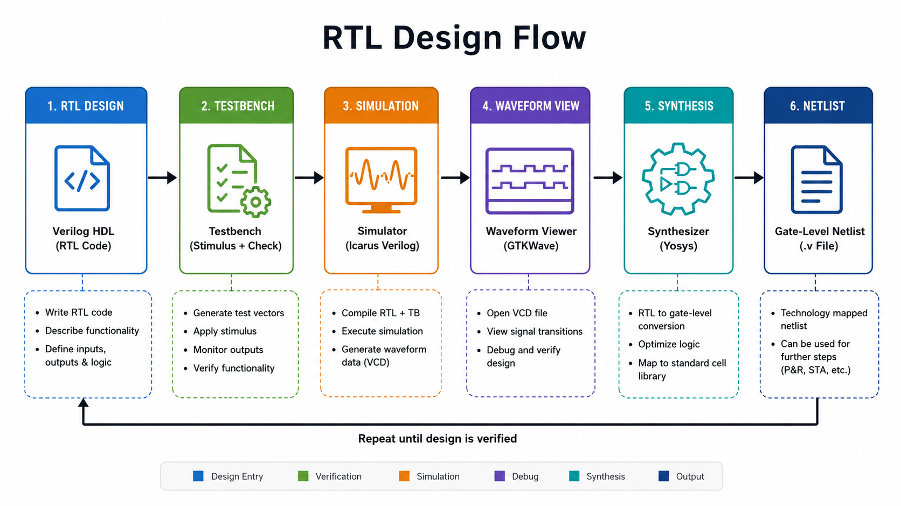
</p>

<p align="center">
<b>Figure 1.</b> RTL design flow.
</p>


## VSDFlow Environment

The workshop utilized the **VSDFlow** environment, which provides a Linux-based workspace pre-configured with open-source Electronic Design Automation (EDA) tools required for RTL design, simulation, and synthesis.

The environment includes the Verilog source files, standard cell libraries, and synthesis tools necessary to perform the complete RTL design flow.

During this session, the following activities were performed:

- Cloned the workshop repository.
- Explored the project directory structure.
- Examined the Verilog source files.
- Accessed the Sky130 standard cell library.
- Executed RTL simulation examples.
- Performed RTL synthesis using Yosys.

<p align="center">
    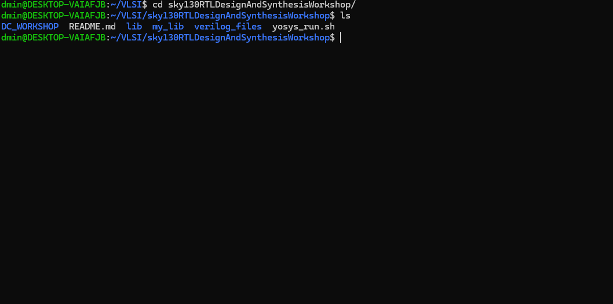
</p>

<p align="center">
<b>Figure 2.</b> VSDFlow Workspace used during the workshop.
</p>

---

## RTL Design

RTL (Register Transfer Level) is a hardware description methodology used to describe the behavior and data flow of digital circuits using hardware description languages such as Verilog.

The RTL design represents the intended hardware functionality and serves as the primary input for both simulation and synthesis.

At this stage, only the logical behavior of the circuit is described; no physical implementation details are considered.

<p align="center">
    
</p>

<p align="center">
<b>Figure 3.</b> RTL Design Representation.
</p>

---

## Simulator

A simulator verifies the functional correctness of an RTL design before it is synthesized into hardware.

Whenever an input signal changes, the simulator evaluates the design and updates the corresponding outputs. The signal transitions generated during simulation are recorded in a Value Change Dump (VCD) file, which can later be visualized using GTKWave.

### Key Responsibilities

- Functional verification of RTL designs
- Detection of logical errors
- Generation of simulation waveforms
- Creation of VCD files for waveform analysis

<p align="center">
    
</p>

<p align="center">
<b>Figure 4.</b> RTL Simulation using Icarus Verilog.
</p>

---

## Design Module

The Design Module contains the Verilog implementation of the required digital circuit.

It defines the circuit inputs, outputs, internal logic, and functionality. The Design Module is the hardware description that will eventually be synthesized into a gate-level implementation.

Unlike the Testbench, the Design Module is synthesizable and represents the actual hardware.

<p align="center">
    
</p>

<p align="center">
<b>Figure 5.</b> Structure of the RTL Design Module.
</p>

---

## Testbench

A Testbench is a verification module written specifically for simulation purposes. It is responsible for applying different input combinations to the Design Under Test (DUT) and verifying the generated outputs.

Unlike the RTL design, the Testbench is **not synthesized** into hardware. Its purpose is limited to simulation and functional verification.

The Testbench performs the following tasks:

- Generates input stimulus
- Instantiates the Design Under Test (DUT)
- Monitors output responses
- Generates waveform files (.vcd)
- Verifies functional correctness

### Relationship between Design and Testbench

The Testbench applies different combinations of input signals to the Design Under Test (DUT). The DUT processes these inputs and produces the corresponding outputs, which are monitored by the Testbench to verify correct functionality.

<p align="center">
    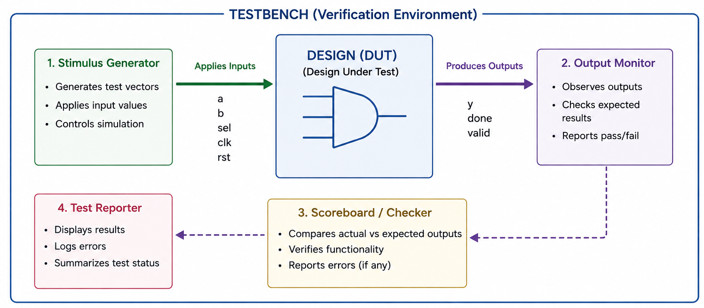
</p>

<p align="center">
<b>Figure 6.</b> Relationship between the Testbench and the Design Under Test (DUT).
</p>


## RTL Simulation Flow

RTL simulation is the process of verifying the functional behavior of a digital design before it is synthesized into hardware. The RTL design and its corresponding Testbench are compiled together using **Icarus Verilog**. The compiled executable is then simulated to generate a Value Change Dump (VCD) file, which is analyzed using **GTKWave**.

<p align="center">
    
</p>

<p align="center">
<b>Figure 7.</b> RTL Simulation Flow using Icarus Verilog and GTKWave.
</p>


### The simulation flow consists of the following steps:
1. Write the RTL Design (`good_mux.v`).
2. Create the Testbench (`tb_good_mux.v`).
3. Compile both files using Icarus Verilog.
4. Execute the compiled simulation.
5. Generate the VCD waveform file.
6. Visualize the waveform using GTKWave.


---

## Practical Session

The practical session was performed using **Ubuntu running on Windows Subsystem for Linux (WSL)**. Although the workshop demonstrations were conducted on Ubuntu Virtual Machine, the same workflow was successfully reproduced in the WSL environment.

### Step 1 – Navigate to the Project Directory

Navigate to the workshop repository.

```bash
cd ~/VLSI/sky130RTLDesignAndSynthesisWorkshop
```

Verify the current working directory.

```bash
pwd
```

List the available files and directories.

```bash
ls
```

<p align="center">
    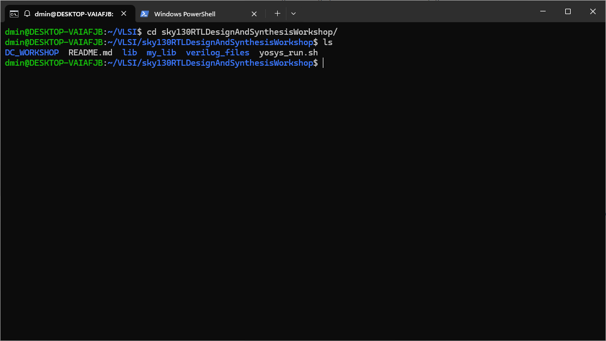
</p>

<p align="center">
<b>Figure 8.</b> Workshop project directory.
</p>

---

### Step 2 – Navigate to the Verilog Files

Move to the directory containing the RTL examples.

```bash
cd verilog_files
```

Display all available Verilog source files.

```bash
ls
```

<p align="center">
    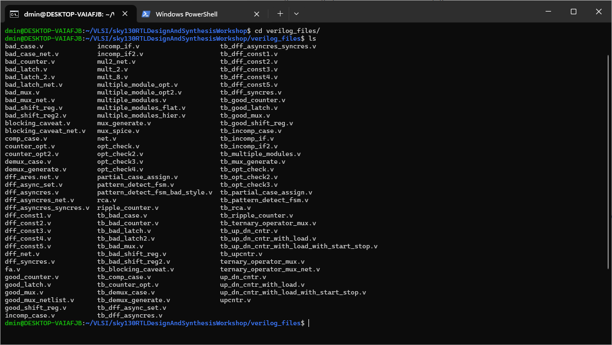
</p>

<p align="center">
<b>Figure 9.</b> Available Verilog source files.
</p>

---

### Step 3 – RTL Design File

Open the RTL source file.

```bash
gedit good_mux.v &
```

or

```bash
nano good_mux.v
```

The RTL file describes the hardware functionality of the multiplexer.

<p align="center">
    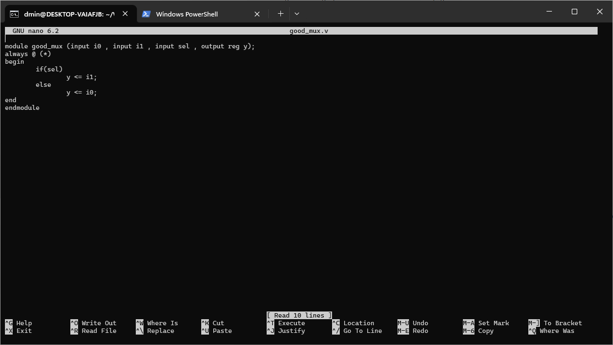
</p>

<p align="center">
<b>Figure 10.</b> RTL Design (`good_mux.v`).
</p>

---

### Step 4 – Testbench File

Open the corresponding Testbench.

```bash
gedit tb_good_mux.v &
```

or

```bash
nano tb_good_mux.v
```

The Testbench generates input stimulus, instantiates the DUT, and verifies the output behavior.

<p align="center">
    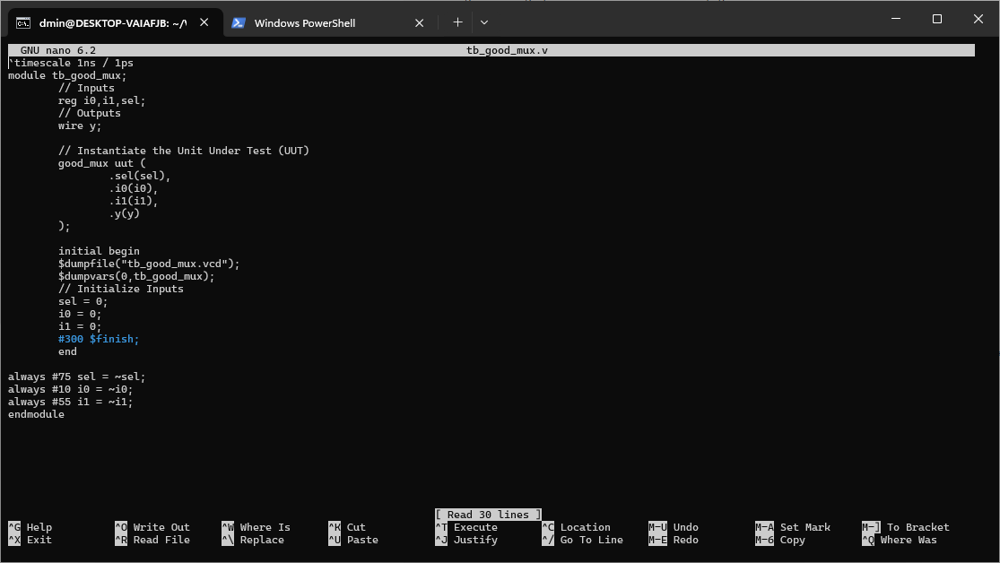
</p>

<p align="center">
<b>Figure 11.</b> Testbench (`tb_good_mux.v`).
</p>

---

### Step 5 – Compile the Design

Compile the RTL Design and Testbench together.

```bash
iverilog good_mux.v tb_good_mux.v
```

After successful compilation, Icarus Verilog generates an executable file named **`a.out`**.

<p align="center">
    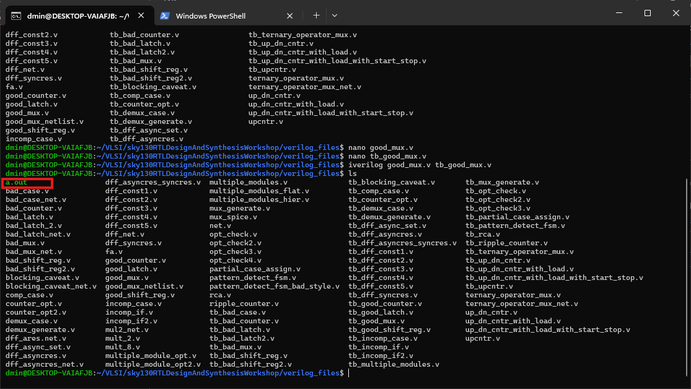
</p>

<p align="center">
<b>Figure 12.</b> RTL compilation using Icarus Verilog.
</p>

---

### Step 6 – Execute the Simulation

Run the compiled executable.

```bash
vvp a.out
```

This command executes the simulation and generates the waveform database file (`.vcd`).

<p align="center">
    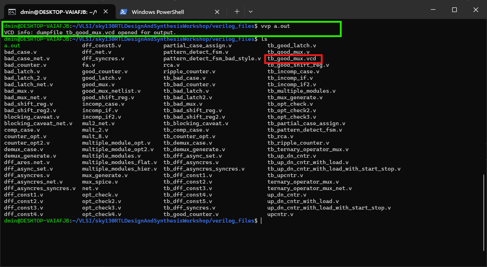
</p>

<p align="center">
<b>Figure 13.</b> Simulation execution.
</p>

---

### Step 7 – Waveform Analysis

Open the generated VCD file using GTKWave.

```bash
gtkwave tb_good_mux.vcd
```

GTKWave displays the transitions of all selected signals, allowing verification of the RTL functionality over time.

<p align="center">
    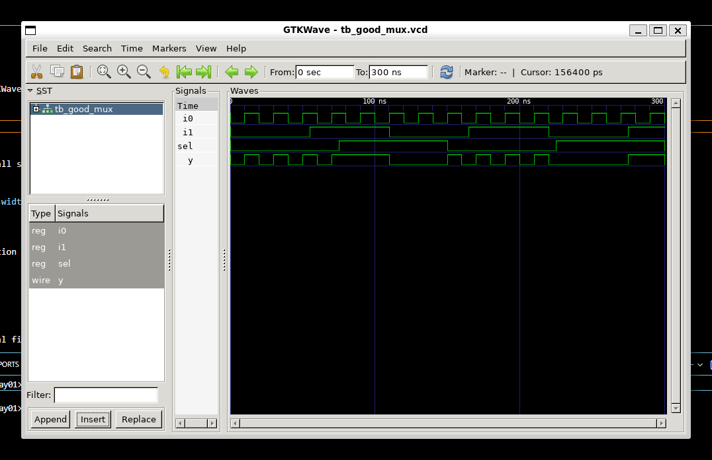
</p>

<p align="center">
<b>Figure 14.</b> Waveform visualization using GTKWave.
</p>

---

## Generated Files

During the simulation process, several files are generated automatically.

| File | Description |
|------|-------------|
| `good_mux.v` | RTL Design |
| `tb_good_mux.v` | Testbench |
| `a.out` | Executable generated by Icarus Verilog |
| `good_mux.vcd` | Value Change Dump (Waveform Database) |

The relationship between these files is summarized below.

| Input | Process | Output |
|--------|---------|--------|
| RTL Design + Testbench | Icarus Verilog | `a.out` |
| `a.out` | VVP Simulator | `good_mux.vcd` |
| `good_mux.vcd` | GTKWave | Signal Waveforms |


---

# RTL Synthesis

After verifying the functional correctness of the RTL design through simulation, the next step is **RTL Synthesis**.

RTL synthesis is the process of converting a Verilog RTL description into a **Gate-Level Netlist** by mapping the design to the cells available in a **Standard Cell Library**.

Unlike simulation, which verifies functionality, synthesis prepares the design for hardware implementation.

The workshop used **Yosys**, an open-source RTL synthesis tool, to perform this conversion.

<p align="center">
    
</p>

<p align="center">
<b>Figure 8.</b> RTL Synthesis Flow using Yosys.
</p>

---

## RTL Synthesis Flow

The synthesis process performed during the workshop follows the sequence shown below.

1. Read the RTL Verilog file.
2. Read the Standard Cell Library (.lib).
3. Check the design hierarchy.
4. Perform RTL synthesis.
5. Optimize and map the design using ABC.
6. Generate the synthesized gate-level netlist.

---

## Invoking Yosys

Launch the Yosys synthesis environment.

```bash
yosys
```

After launching, the terminal displays the Yosys interactive shell.

```text
yosys>
```

---

## Reading the RTL Design

The Verilog RTL file is loaded into the Yosys design database.

```bash
read_verilog good_mux.v
```

---

## Reading the Standard Cell Library

Load the Sky130 standard cell library.

```bash
read_liberty -lib ../lib/sky130_fd_sc_hd__tt_025C_1v80.lib
```

The liberty file provides timing and functional information for the available standard cells.

---

## Checking the Design Hierarchy

Specify the top-level module.

```bash
hierarchy -check -top good_mux
```

This command verifies that all modules are connected correctly before synthesis.

---

## Performing RTL Synthesis

Run the synthesis engine.

```bash
synth -top good_mux
```

During synthesis, Yosys converts the RTL description into an intermediate gate-level representation.

---

## Technology Mapping using ABC

After synthesis, the logic is optimized and mapped to the target standard cell library.

```bash
abc -liberty ../lib/sky130_fd_sc_hd__tt_025C_1v80.lib
```

ABC performs:

- Logic optimization
- Boolean simplification
- Technology mapping
- Cell selection


<p align="center">
    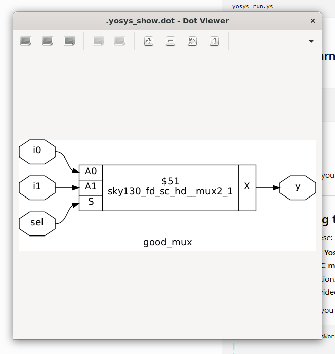
</p>

<p align="center">
<b>Figure .</b> RTL Synthesis Flow using Yosys.
</p>

---


## Generating the Gate-Level Netlist

Export the synthesized design.

```bash
write_verilog good_mux_netlist.v
```

The generated file contains the synthesized gate-level implementation of the RTL design.

---

## Generated Files after Synthesis

| File | Description |
|------|-------------|
| `good_mux.v` | RTL Design |
| `sky130_fd_sc_hd__tt_025C_1v80.lib` | Standard Cell Library |
| `good_mux_netlist.v` | Gate-Level Netlist |

---

## Netlist Verification

To verify that synthesis has preserved the original functionality, the generated netlist is simulated using the same Testbench.

Compile the synthesized netlist.

```bash
iverilog good_mux_netlist.v tb_good_mux.v
```

Execute the simulation.

```bash
vvp a.out
```

Open the generated waveform.

```bash
gtkwave good_mux.vcd
```

The waveform generated from the synthesized netlist should match the waveform obtained from the original RTL simulation.

---

## Difference Between Simulation and Synthesis

| RTL Simulation | RTL Synthesis |
|---------------|---------------|
| Verifies functionality | Converts RTL into hardware |
| Uses Testbench | Uses Standard Cell Library |
| Generates VCD file | Generates Gate-Level Netlist |
| Uses Icarus Verilog | Uses Yosys |
| Displays waveform in GTKWave | Produces synthesizable netlist |

---

## Observations

- RTL simulation verifies functional correctness before hardware implementation.
- The Testbench is used only for simulation and is not synthesized.
- Icarus Verilog generates an executable file and VCD waveform database.
- GTKWave is used to analyze the generated waveforms.
- Yosys converts the RTL description into a technology-mapped gate-level netlist.
- ABC performs optimization and technology mapping using the Sky130 standard cell library.
- The synthesized netlist can be verified using the original Testbench.

---

## Conclusion

Day 1 introduced the complete RTL development workflow starting from RTL design, simulation, waveform analysis, and synthesis.

The practical session demonstrated how a Verilog design is compiled using Icarus Verilog, verified using GTKWave, synthesized using Yosys, and finally converted into a gate-level netlist ready for hardware implementation.

---

## Learning Outcomes

At the end of Day 1, I was able to:

- Understand the RTL design methodology.
- Develop and simulate Verilog RTL designs.
- Create and use Testbenches for functional verification.
- Analyze simulation waveforms using GTKWave.
- Perform RTL synthesis using Yosys.
- Understand technology mapping using ABC.
- Generate a gate-level netlist.
- Verify the synthesized design using the original Testbench.